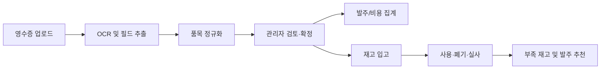
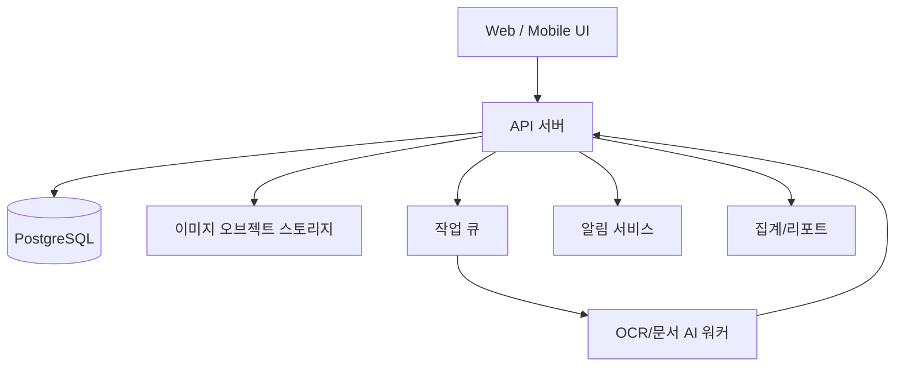

# OrderFit 제품 기획 및 기본 아키텍처

## 1. 제품 목표

OrderFit은 레스토랑의 종이 영수증과 산재된 발주 기록을 구조화된 데이터로 전환하는 발주 관리 서비스다. 관리자가 영수증 사진을 올리면 OCR/AI가 업체, 품목, 수량, 금액을 추출하고, 검토·확정된 데이터를 기반으로 발주비·재고·사용량을 관리한다.

### 핵심 사용자

| 역할 | 주요 업무 |
| --- | --- |
| 관리자/점장 | 영수증 확정, 지출·예산·업체 리포트 확인 |
| 주방장 | 재고 확인, 사용량 기록, 발주 요청 |
| 현장 직원 | 영수증 촬영·업로드, 입고 및 폐기 기록 |

## 2. 사용자 흐름

1. 직원이 영수증을 촬영하거나 이미지/PDF를 업로드한다.
2. OCR 서비스가 원본 이미지와 함께 업체명, 날짜, 총액, 품목 행을 추출한다.
3. 품목 정규화 서비스가 `국산 양파 20KG` 같은 원문을 표준 품목 `양파`와 단위·규격에 연결한다.
4. 관리자가 인식 결과를 확인·수정하고 발주를 확정한다.
5. 확정된 행은 업체/품목 지출 집계와 입고 재고에 반영된다.
6. 주방이 사용·폐기·실사를 기록하면 현재고와 소진예측이 갱신된다.

## 3. MVP 범위

### 포함

- 영수증 업로드, OCR 처리 상태, 검토 및 수정
- 업체·품목·발주 행 CRUD
- 업체별/품목별 누적 금액, 단가 추이, 기간 필터
- 입고·사용·폐기·재고실사 기록
- 최소재고 기준 기반 알림
- 사용자 역할: 관리자, 주방장, 직원

### 후속 범위

- POS 매출과 레시피(BOM) 연동에 따른 자동 재고 차감
- 회계/세금계산서 연동 및 결제 관리
- 공급사별 견적 비교 및 자동 발주서 발송
- 다지점 통합 분석과 승인 워크플로

## 4. 핵심 화면

| 화면 | 핵심 정보/행동 |
| --- | --- |
| 대시보드 | 월 발주액, 전월 증감, 부족재고, 단가 상승 품목 |
| 영수증 검토 | 원본 이미지, OCR 신뢰도, 행 단위 수정·확정 |
| 업체 상세 | 누적금액, 발주 횟수, 품목별 거래 및 최근 단가 |
| 품목 상세 | 표준명/별칭, 단위, 평균 단가, 업체 비교, 재고 |
| 재고 관리 | 입고·사용·폐기·실사 기록, 예상 소진일 |
| 리포트 | 기간별 비용, 카테고리/업체/품목별 비중 |

## 5. 데이터 모델

| 엔티티 | 주요 필드 |
| --- | --- |
| Organization | id, name, timezone |
| User | id, organization_id, role, name, email |
| Vendor | id, organization_id, name, business_number, payment_terms |
| Item | id, organization_id, name, category, base_unit, minimum_stock |
| ItemAlias | id, item_id, vendor_id, raw_name, package_size, conversion_factor |
| Receipt | id, vendor_id, image_url, receipt_date, subtotal, tax, total, ocr_status, confidence |
| PurchaseOrder | id, receipt_id, vendor_id, ordered_at, status, total_amount |
| PurchaseLine | id, purchase_order_id, item_id, raw_name, quantity, unit, unit_price, amount |
| InventoryTransaction | id, item_id, type, quantity, occurred_at, reference_type, reference_id |
| StockSnapshot | id, item_id, counted_quantity, counted_at |

`InventoryTransaction.type`은 `RECEIPT`, `USAGE`, `WASTE`, `ADJUSTMENT`를 사용한다. 재고는 거래 원장을 합산해 계산하며, 실사는 조정 거래를 생성해 이력을 보존한다.

## 6. 권장 시스템 아키텍처

### 권장 구현 스택

- 클라이언트: Next.js + TypeScript, Tailwind CSS
- API: Next.js Route Handler 또는 NestJS
- 데이터: PostgreSQL + Prisma
- 파일: S3 호환 오브젝트 스토리지, 원본 영수증은 암호화 저장
- 비동기: Redis 기반 큐(BullMQ)로 OCR 작업 분리
- 인증: 조직 단위 멀티테넌시와 역할 기반 접근 제어(RBAC)

## 7. API 초안

| Method | Path | 용도 |
| --- | --- | --- |
| POST | `/receipts` | 이미지 업로드 및 OCR 작업 생성 |
| GET | `/receipts/:id` | OCR 결과와 영수증 상세 조회 |
| PATCH | `/receipts/:id/confirm` | 수정한 행을 포함해 발주 확정 |
| GET | `/vendors/:id/summary` | 기간별 업체 지출·품목 요약 |
| GET | `/items/:id/analytics` | 단가·구매량·재고 추이 |
| POST | `/inventory/transactions` | 입고/사용/폐기/조정 등록 |
| GET | `/dashboard` | 핵심 지표와 알림 조회 |

## 8. 검증과 운영 원칙

- OCR 결과는 자동 확정하지 않는다. 신뢰도 낮은 필드와 금액 불일치는 관리자 검토 대상으로 표시한다.
- 총액과 각 행 금액의 합, 세금 계산을 검증해 오류를 표시한다.
- 원문 품목명과 표준 품목 연결 이력을 보관한다.
- 모든 금액 수정·확정·재고 조정은 사용자와 시간 정보를 포함한 감사 로그를 남긴다.
- 업체명, 품목, 단위는 조직별 마스터 데이터로 관리한다.
